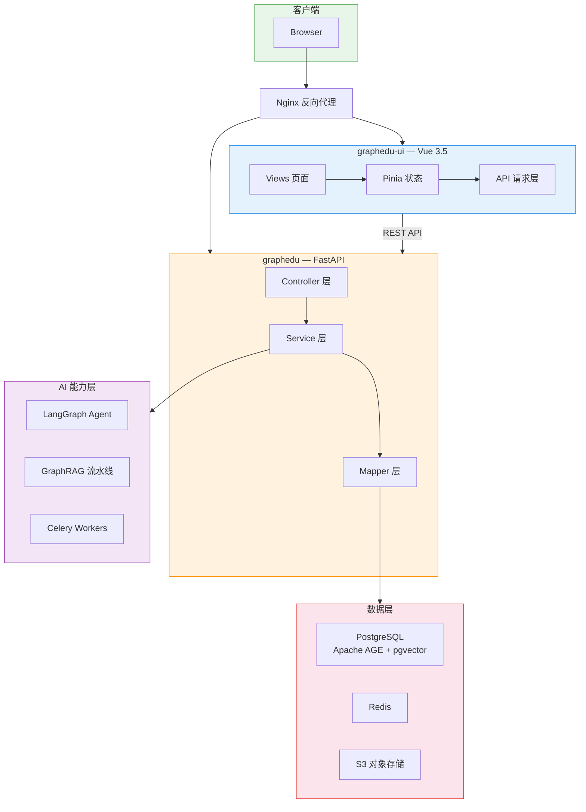
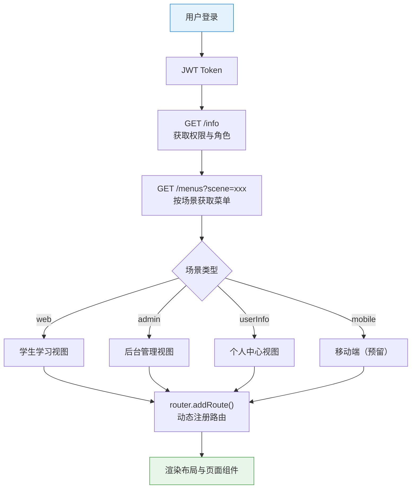
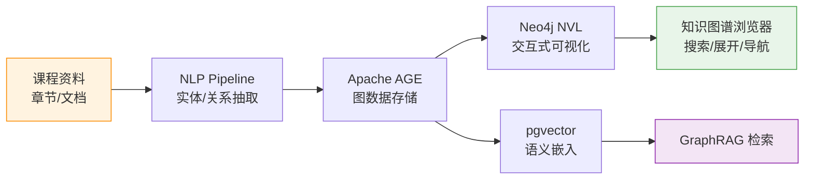
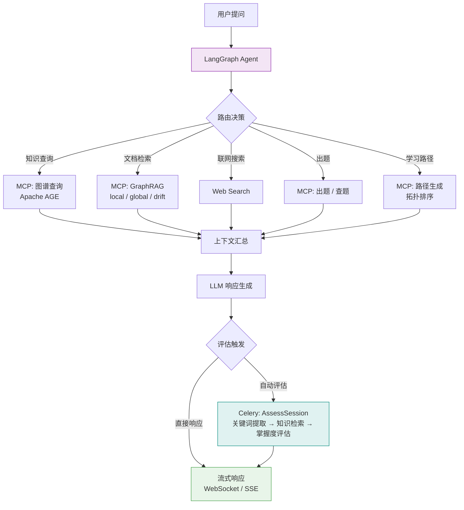
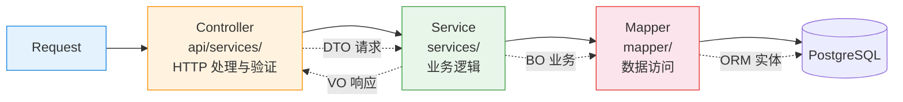

<div align="center">

# GraphEdu

**基于知识图谱的智能教育平台**

[](https://www.python.org/)
[](https://vuejs.org/)
[](https://fastapi.tiangolo.com/)
[](https://www.postgresql.org/)
[](https://github.com/langchain-ai/langgraph)
[](https://www.docker.com/)
[](LICENSE)

融合知识图谱可视化、AI 智能问答、PDF 深度阅读的新一代教育平台。采用前后端分离架构，提供从课程管理到个性化学习路径的完整解决方案。

</div>

---

## 项目亮点

| | | | |
|:---|:---|:---|:---|
| **知识图谱驱动** | Apache AGE 图存储 + pgvector 语义检索，Neo4j NVL 交互式可视化 | **AI 智能助手** | LangGraph Agent 多源 RAG（图谱 + 向量 + 联网），MCP 工具集成，WebSocket 流式响应 |
| **PDF 智能阅读** | pdfjs-dist 多层渲染：HiDPI Canvas + 文本选中 + 标注，虚拟滚动优化 | **多角色动态路由** | 学生 / 教师双视图，4 场景路由（web / admin / userInfo / mobile），三级权限安全 |
| **学习分析** | 掌握度追踪，拓扑排序学习路径，自动出题评估，教学数据看板 | | |

---

## 系统架构



---

## 核心功能

### 动态路由与权限系统

登录后按场景动态加载菜单与路由，实现学生、管理员等不同角色的差异化视图。



### 知识图谱构建与可视化

从课程资料自动抽取实体与关系，构建知识图谱并支持交互式探索。



### AI 智能问答

LangGraph Agent 驱动的多源检索增强生成，支持图谱查询、文档检索、联网搜索、出题和路径规划。



### 后端分层架构

严格三层分离，每层职责明确，通过 Pydantic 模型约束层间数据流转。



---

## 技术栈

| 后端 | 前端 | 基础设施 |
|:---|:---|:---|
| **框架**: FastAPI + SQLAlchemy 2.0（异步） | **框架**: Vue 3.5 + TypeScript 5.9 + Vite 8 | **容器**: Docker Compose |
| **数据库**: PostgreSQL + pgvector | **UI**: Ant Design Vue 4.2 + Tailwind CSS 4.1 | **包管理**: uv + pnpm |
| **图存储**: Apache AGE | **状态**: Pinia 3 / vue-i18n 11.3 | **对象存储**: S3 兼容（阿里云 OSS 等） |
| **AI**: LangChain + LangGraph + GraphRAG | **PDF**: pdfjs-dist 5.6 | **代码质量**: Ruff + oxlint |
| **任务队列**: Celery + Redis | **图可视化**: Neo4j NVL | **测试**: pytest + Vitest + Playwright |
| **缓存**: Redis | **图表**: ECharts 6 | **CI/CD**: GitHub Actions |

---

## 快速开始

### 环境要求

- Python 3.12+
- Node.js 20.19+ / 22.12+ / 24.9+
- PostgreSQL（含 Apache AGE、pgvector 插件） + Redis
- Docker & Docker Compose（部署用）

### 开发

```bash
# 克隆仓库
git clone https://github.com/ZK-Jackie/GraphEdu.git
cd GraphEdu

# 后端配置
cp example.config.yaml dev.config.yaml
# 编辑 dev.config.yaml，配置数据库、Redis、AI 模型 API Key 等
vim dev.config.yaml

# 后端启动
uv sync --all-extras
uv run -m graphedu service dev

# 前端配置
cd graphedu-ui
# 编辑 .env.development 配置 API 地址
vim .env.development

# 前端启动
pnpm install
pnpm dev
```

---

## 部署

### Docker 部署（推荐）

```bash
# 1. 克隆仓库到服务器
git clone https://github.com/ZK-Jackie/GraphEdu.git /path/to/deploy
cd /path/to/deploy

# 2. 配置后端
cp example.config.yaml prod.config.yaml
# 编辑 prod.config.yaml，DSN 使用 Docker 服务名/容器名（如 graphedu-postgres:5432）
vim prod.config.yaml

# 3. 配置前端
cd graphedu-ui
cp .env.development .env.production
# 编辑 .env.production 配置生产环境 API 地址
vim .env.production
cd ..

# 4. 生成 Docker 环境变量
cd docker

# 方式一：使用独立脚本（仅需 Python 3 + PyYAML，无需构建任何镜像）
pip install pyyaml
python3 generate-env.py -c ../prod.config.yaml

# 方式二：使用 Docker（无需本地 Python，与后端共用 uv 镜像层）
docker compose --profile env-gen run --rm env-generator

# 5. 构建并启动
docker compose up -d --build
```

### 手动部署

```bash
# 后端
uv sync --all-extras
cp example.config.yaml prod.config.yaml
# 配置 prod.config.yaml （数据库 DSN、Token 密钥等）
vim prod.config.yaml
uv run -m graphedu service prod

# 后端 celery worker
uv run -m graphedu worker start
# 后端 beat scheduler
uv run -m graphedu beat start

# 前端
cd graphedu-ui
cp .env.development .env.production
# 编辑 .env.production 配置生产环境变量
vim .env.production
pnpm build
# 将 dist/ 部署到 Nginx 等 Web 服务器
```

详细部署文档见 [`docker/README.md`](docker/README.md)。

---

## 许可证

[MIT](LICENSE)
